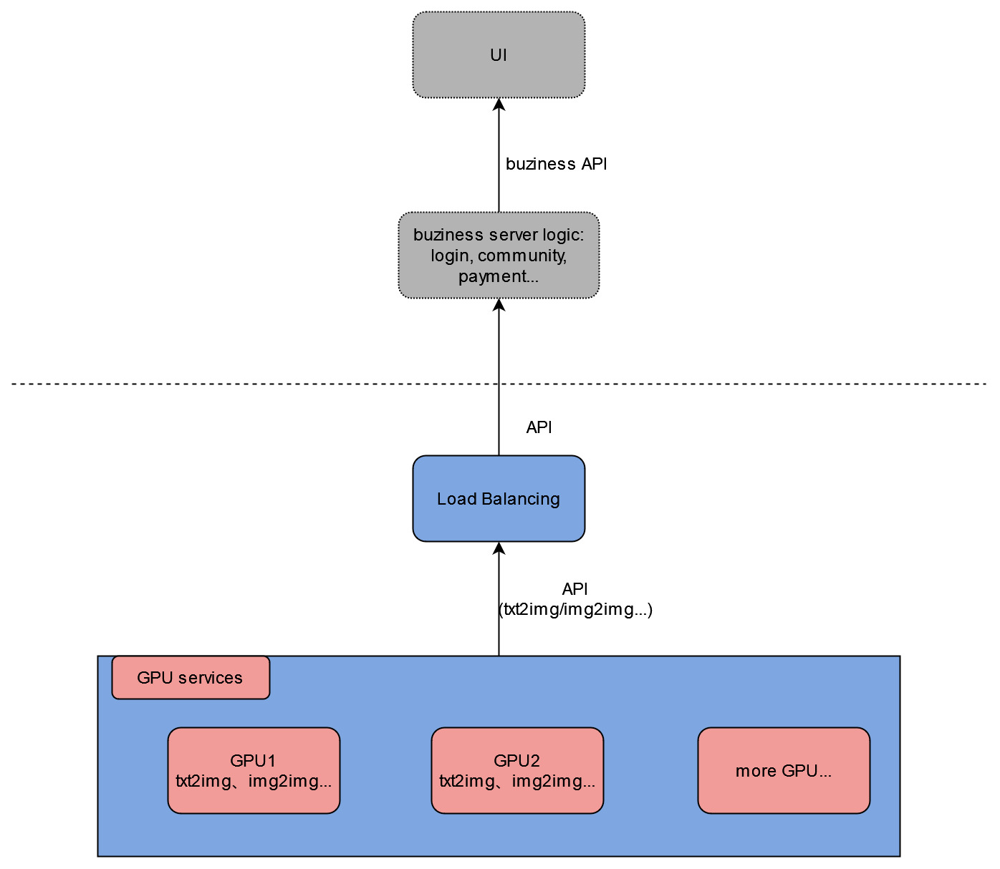

# Stable Diffusion Multi-user
> stable diffusion multi-user django server code with multi-GPU load balancing 

# Features

- a django server that provides stable-diffusion http API, including:
    - txt2img
    - img2img
    - check generating progress
    - interrupt generating
    - list available models
    - change models
    - ...
- supports civitai models and lora, etc.
- supports multi-user queuing
- supports multi-user separately changing models, and won't affect each other
- provides downstream load-balancing server code that automatically do load-balancing among available GPU servers, and ensure that user requests are sent to the same server within one generation cycle

You can build your own UI, community features, account login&payment, etc. based on these functions!



# Project directory structure

The project can be roughly divided into two parts: django server code, and [stable-diffusion-webui](https://github.com/AUTOMATIC1111/stable-diffusion-webui) code that we use to initialize and run models. And I'll mainly explain the django server part.

In the main project directory:

- `modules/`: stable-diffusion-webui modules
- `sd_multi/`: the django project name
    - `urls.py`: server API path configuration
- `simple/`: the main django code
    - `views.py`: main API processing logic
    - `lb_views.py`: load-balancing API
- `requirements.txt`: stable diffusion pip requirements
- `setup.sh`: run it with options to setup the server environment
- `gen_http_conf.py`: called in `setup.sh` to setup the apache configuration

# Deploy on a GPU server

1. SSH to the GPU server
2. clone or download the repository
3. cd to the main project directory(that contains `manage.py`)
4. run `sudo bash setup.sh` with options(checkout the `setup.sh` for options)(recommende order: follow the file order: `env`, `venv`, `sd_model`, `apache`)
    - if some downloads are slow, you can always download manually and upload to your server
    - if you want to change listening ports: change both `/etc/apache2/ports.conf` and `/etc/apache2/sites-available/sd_multi.conf`
5. restart apache: `sudo service apache2 restart`

## API definition

- `/`: view the homepage, used to test that apache is configured successfully
- `/txt2img/`: try the txt2img with stable diffusion
```
// demo request
task_id: required string,
model: optional string, // change model with this param
prompt: optional string,
negative_prompt: optional string,
sampler_name: optional string,
steps: optional int, // default=20
cfg_scale: optional int, // default=8
width: optional int, // default=512
height: optional int, // default=768
seed: optional int // default=-1
restore_faces: optional int // default=0
n_iter: optional int // default = 1
// ...
// modify views.py for more optional parameters

// response
images: list<string>, // image base64 data list
parameters: string
```

- `/img2img`: stable diffusion img2img
```
// demo request
task_id: required string,
model: optional string, // change model with this param
prompt: optional string,
negative_prompt: optional string,
sampler_name: optional string,
steps: optional int, // default=20
cfg_scale: optional int, // default=8
width: optional int, // default=512
height: optional int, // default=768
seed: optional int // default=-1
restore_faces: optional int // default=0
n_iter: optional int // default = 1
resize_mode: optional int // default=0
denoising_strength: optional double // default=0.75
init_images: optional list<base64 image data>
// ...
// modify views.py for more optional parameters

// response
images: list<string>, // image base64 data list
parameters: string
```

- `/progress/`: get the generation progress
```
// request
task_id: required string

// response
progress: float, // progress percentage
eta: float, // eta seconds
```

- `/interrupt/`: terminate an unfinished generation
```
// request
task_id: required string
```

- `/list_models/`: list available models
```
// response
models: list<string>
```

# Deploy the load-balancing server

1. SSH to a CPU server
2. clone or download the repository
3. cd to the main project directory(that contains `manage.py`)
4. run `sudo bash setup.sh lb`
5. run `mv sd_multi/urls.py sd_multi/urls1.py && mv sd_multi/urls_lb.py sd_multi/urls.py`
6. modify `ip_list` variable with your own server ip+port in `simple/lb_views.py`
7. restart apache: `sudo service apache2 restart`
8. to test it, view `ip+port/multi_demo/` url path

## Test the load-balancing server locally
If you don't want to deploy the load balancing server but still want to test the functions, you can start the load-balancing server on your local computer.

1. clone or download the repository
2. requirements: python3, django, django-cors-headers, replicate
3. modify `ip_list` variable with your own GPU server ip+port in `simple/lb_views.py`
4. cd to the main project directory(that contains `manage.py`)
5. run `mv sd_multi/urls.py sd_multi/urls1.py` && `mv sd_multi/urls_lb.py sd_multi/urls.py` (Rename)
6. run `python manage.py runserver`
7. click the url that shows up in the terminal, view `/multi_demo/` path

Finally, you can call your http API(test it using postman).